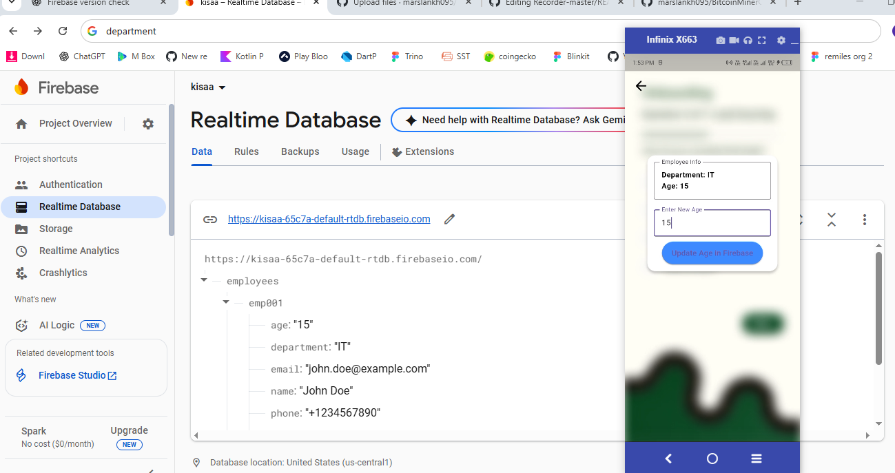
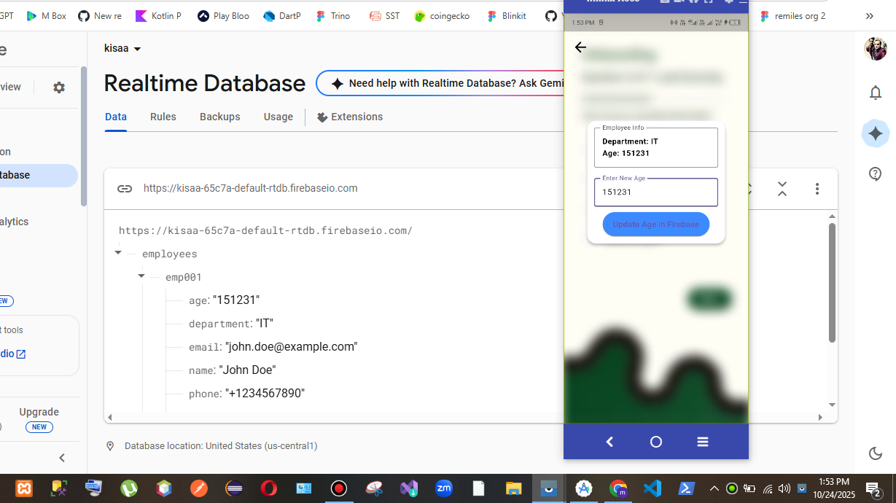
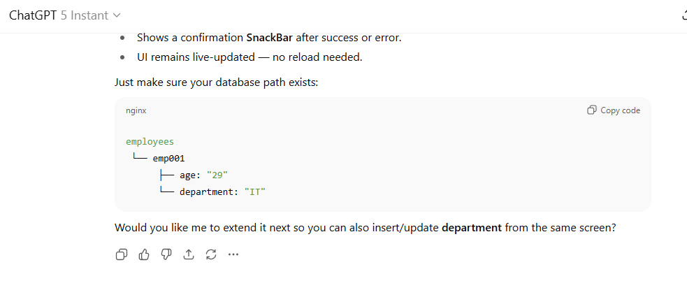

 
 
  

allprojects {
    repositories {
        google()
        mavenCentral()
    }
}

val newBuildDir: Directory = rootProject.layout.buildDirectory.dir("../../build").get()
rootProject.layout.buildDirectory.value(newBuildDir)

subprojects {
    val newSubprojectBuildDir: Directory = newBuildDir.dir(project.name)
    project.layout.buildDirectory.value(newSubprojectBuildDir)
}
subprojects {
    project.evaluationDependsOn(":app")
}

tasks.register<Delete>("clean") {
    delete(rootProject.layout.buildDirectory)
}
plugins {

    id("com.google.gms.google-services") version "4.4.4" apply false
}

plugins {
    id("com.android.application")
    id("kotlin-android")

    // Add this line for Firebase
    id("com.google.gms.google-services")
     // The Flutter Gradle Plugin must be applied after the Android and Kotlin Gradle plugins.
    id("dev.flutter.flutter-gradle-plugin")
}

android {
    namespace = "com.example.majh"
    compileSdk = flutter.compileSdkVersion
    ndkVersion = flutter.ndkVersion

    compileOptions {
        sourceCompatibility = JavaVersion.VERSION_11
        targetCompatibility = JavaVersion.VERSION_11
    }

    kotlinOptions {
        jvmTarget = JavaVersion.VERSION_11.toString()
    }

    defaultConfig {
        // TODO: Specify your own unique Application ID (https://developer.android.com/studio/build/application-id.html).
        applicationId = "com.example.majh"
        // You can update the following values to match your application needs.
        // For more information, see: https://flutter.dev/to/review-gradle-config.
        minSdk = flutter.minSdkVersion
        targetSdk = flutter.targetSdkVersion
        versionCode = flutter.versionCode
        versionName = flutter.versionName
    }

    buildTypes {
        release {
            // TODO: Add your own signing config for the release build.
            // Signing with the debug keys for now, so `flutter run --release` works.
            signingConfig = signingConfigs.getByName("debug")
        }
    }
}

flutter {
    source = "../.."
}

<manifest xmlns:android="http://schemas.android.com/apk/res/android">
    <uses-permission android:name="android.permission.INTERNET"/>

    <application
        android:label="Remiles"
        android:name="${applicationName}"
        android:icon="@mipmap/ic_launcher">
        <activity
            android:name=".MainActivity"
            android:exported="true"
            android:launchMode="singleTop"
            android:taskAffinity=""
            android:theme="@style/LaunchTheme"
            android:configChanges="orientation|keyboardHidden|keyboard|screenSize|smallestScreenSize|locale|layoutDirection|fontScale|screenLayout|density|uiMode"
            android:hardwareAccelerated="true"
            android:windowSoftInputMode="adjustResize">
            <!-- Specifies an Android theme to apply to this Activity as soon as
                 the Android process has started. This theme is visible to the user
                 while the Flutter UI initializes. After that, this theme continues
                 to determine the Window background behind the Flutter UI. -->
            <meta-data
                android:name="io.flutter.embedding.android.NormalTheme"
                android:resource="@style/NormalTheme"
                />
            <intent-filter>
                <action android:name="android.intent.action.MAIN"/>
                <category android:name="android.intent.category.LAUNCHER"/>
            </intent-filter>
        </activity>
        <!-- Don't delete the meta-data below.
             This is used by the Flutter tool to generate GeneratedPluginRegistrant.java -->
        <meta-data
            android:name="flutterEmbedding"
            android:value="2" />
    </application>
    <!-- Required to query activities that can process text, see:
         https://developer.android.com/training/package-visibility and
         https://developer.android.com/reference/android/content/Intent#ACTION_PROCESS_TEXT.

         In particular, this is used by the Flutter engine in io.flutter.plugin.text.ProcessTextPlugin. -->
    <queries>
        <intent>
            <action android:name="android.intent.action.PROCESS_TEXT"/>
            <data android:mimeType="text/plain"/>
        </intent>
    </queries>
</manifest>

name: majh
description: "A new Flutter project."
publish_to: 'none'

version: 1.0.0+1

environment:
  sdk: '>=3.8.1 <4.0.0'

dependencies:
  flutter:

    sdk: flutter
  cupertino_icons: ^1.0.8
  flutter_screenutil: ^5.9.3
  font_awesome_flutter: ^10.9.0
  flutter_svg: ^2.2.0
  firebase_core: ^3.15.2
  firebase_database: ^11.3.10

dev_dependencies:
  flutter_test:
    sdk: flutter
  flutter_lints: ^5.0.0

flutter:
  uses-material-design: true

  assets:
    - assets/monogram.png
    - assets/remiles.png
    - assets/leather.png
    - assets/remileswithtagline.svg
    - assets/white_rectangle.png
    - assets/leather_rectangle.png
    - assets/carrier_icon.png
    - assets/shipper_icon.png
    - assets/google.png
    - assets/apple.png
    - assets/login_button.png
    - assets/leather_up.png
    - assets/user.png
    - assets/map.png
    - assets/flag.png
    - assets/phone.png
    - assets/email.png
    - assets/password.png
    - assets/signup_button.png
    - assets/canada_flag.png
    - assets/other_screen_background.png
    - assets/welcome_wave.png
    - assets/welcome_button.png
    - assets/welcometext.png
    - assets/remileswithtag.png
    # The assets section must include the font directory.

  fonts:
    - family: RobotoFlex
      fonts:
        # Correct path as per your file structure.
        - asset: assets/Roboto.ttf

import 'package:flutter/material.dart';
import 'package:flutter/services.dart';
import 'package:firebase_core/firebase_core.dart';
import 'package:firebase_database/firebase_database.dart';

void main() async {
  WidgetsFlutterBinding.ensureInitialized();
  await Firebase.initializeApp();
  FirebaseDatabase.instance.databaseURL =
  "https://kisaa-65c7a-default-rtdb.firebaseio.com/";
  runApp(const MyApp());
}

class MyApp extends StatefulWidget {
  const MyApp({super.key});

  @override
  State<MyApp> createState() => _MyAppState();
}

class _MyAppState extends State<MyApp> {
  final TextEditingController _displayController = TextEditingController();
  final TextEditingController _ageController = TextEditingController();

  @override
  void initState() {
    super.initState();
    final dbRef = FirebaseDatabase.instance.ref("employees/emp001");

    // Listen to changes in department and age
    dbRef.onValue.listen((event) {
      final data = event.snapshot.value as Map?;
      setState(() {
        if (data != null) {
          final department = data['department'] ?? 'No Department';
          final age = data['age'] ?? 'No Age';
          _displayController.text = "Department: $department\nAge: $age";
        } else {
          _displayController.text = "No Data";
        }
      });
    });
  }

  // Function to update age value in Firebase
  Future<void> _updateAge() async {
    final ageValue = _ageController.text.trim();
    if (ageValue.isEmpty) return;

    try {
      await FirebaseDatabase.instance
          .ref("employees/emp001/age")
          .set(ageValue);

      ScaffoldMessenger.of(context).showSnackBar(
        const SnackBar(content: Text("✅ Age updated successfully")),
      );
      _ageController.clear();
    } catch (e) {
      ScaffoldMessenger.of(context).showSnackBar(
        SnackBar(content: Text("❌ Error updating age: $e")),
      );
    }
  }

  @override
  Widget build(BuildContext context) {
    const double designW = 430.0;
    const double designH = 932.0;

    return MaterialApp(
      debugShowCheckedModeBanner: false,
      home: Builder(
        builder: (context) {
          final screenWidth = MediaQuery.of(context).size.width;
          final screenHeight = MediaQuery.of(context).size.height;
          final double scale = (screenWidth / designW < screenHeight / designH)
              ? screenWidth / designW
              : screenHeight / designH;

          return Scaffold(
            body: AnnotatedRegion<SystemUiOverlayStyle>(
              value: SystemUiOverlayStyle.dark,
              child: SafeArea(
                top: false,
                bottom: false,
                child: Stack(
                  children: [
                    // Background image
                    Positioned.fill(
                      child: Image.asset(
                        'assets/other_screen_background.png',
                        fit: BoxFit.cover,
                      ),
                    ),

                    // Back button
                    Positioned(
                      top: 50 * scale,
                      left: 10 * scale,
                      child: IconButton(
                        icon: Icon(
                          Icons.arrow_back_rounded,
                          color: Colors.black,
                          size: 40 * scale,
                        ),
                        onPressed: () {
                          Navigator.of(context).maybePop();
                        },
                      ),
                    ),

                    // Info + Input Container
                    Positioned(
                      top: 250 * scale,
                      left: (designW - 320) / 2 * scale,
                      child: Container(
                        width: 320 * scale,
                        padding: EdgeInsets.all(16 * scale),
                        decoration: BoxDecoration(
                          color: Colors.white,
                          borderRadius: BorderRadius.circular(20 * scale),
                          boxShadow: const [
                            BoxShadow(
                              color: Color.fromRGBO(0, 0, 0, 0.25),
                              blurRadius: 4,
                              offset: Offset(0, 4),
                            ),
                          ],
                        ),
                        child: Column(
                          mainAxisSize: MainAxisSize.min,
                          children: [
                            // Department + Age display
                            TextField(
                              controller: _displayController,
                              readOnly: true,
                              maxLines: 2,
                              decoration: const InputDecoration(
                                labelText: "Employee Info",
                                border: OutlineInputBorder(),
                              ),
                              style: TextStyle(
                                fontSize: 18 * scale,
                                color: Colors.black,
                                fontWeight: FontWeight.bold,
                              ),
                            ),
                            const SizedBox(height: 20),

                            // Age input
                            TextField(
                              controller: _ageController,
                              keyboardType: TextInputType.number,
                              decoration: const InputDecoration(
                                labelText: "Enter New Age",
                                border: OutlineInputBorder(),
                              ),
                            ),
                            const SizedBox(height: 10),

                            // Update button
                            ElevatedButton(
                              onPressed: _updateAge,
                              style: ElevatedButton.styleFrom(
                                backgroundColor: Colors.blueAccent,
                                padding: const EdgeInsets.symmetric(
                                    horizontal: 20, vertical: 12),
                              ),
                              child: const Text(
                                "Update Age in Firebase",
                                style: TextStyle(fontSize: 16),
                              ),
                            ),
                          ],
                        ),
                      ),
                    ),
                  ],
                ),
              ),
            ),
          );
        },
      ),
    );
  }
}
